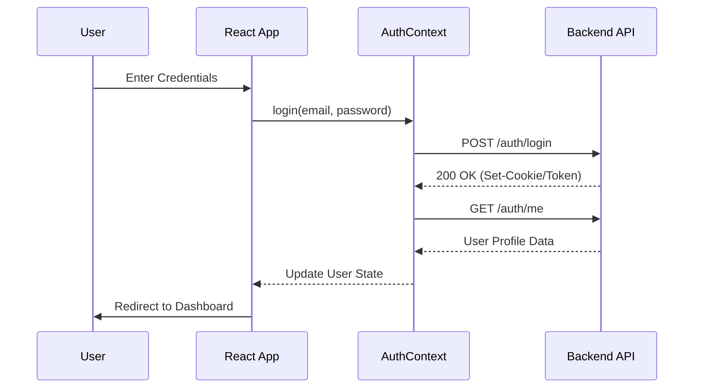
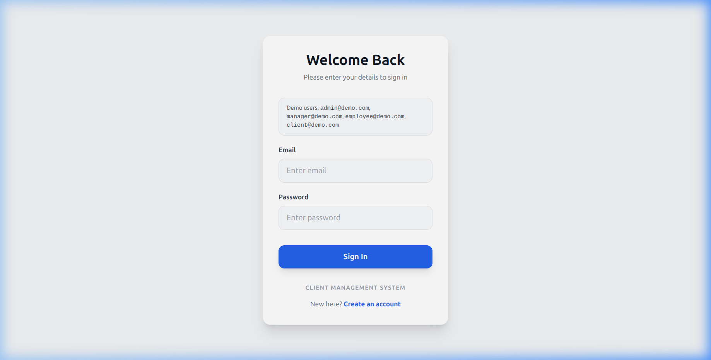
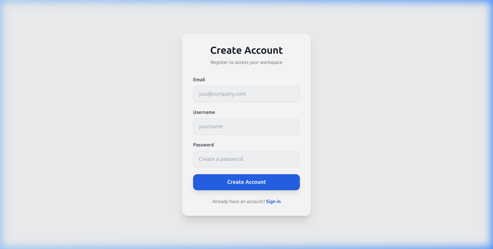

# Client Management SaaS (Frontend)

Client Management SaaS is a modern, high-performance Client Management SaaS application built to streamline business operations, manage client relationships, track projects, and oversee employee performance. This repository contains the frontend application built with React, TypeScript, and Tailwind CSS.

---

## 🔐 Authentication Workflow

The sequential logic for user login and session restoration:



---

## 🚀 Features

### 🔐 Authentication & Authorization
- **JWT-based Authentication**: Secure login and registration flows.
- **Persistent Sessions**: Automatic session recovery using `/auth/me` endpoint.
- **Role-Based Access Control (RBAC)**:
  - **Admin**: Full system access, including employee management and settings.
  - **Manager**: Manage clients, projects, employees, and view reports.
  - **Employee**: View assigned projects and manage tasks.
- **Protected Routes**: Secure navigation ensuring users only access authorized content.

### 📊 Dashboard
- Real-time overview of business metrics.
- Quick navigation to key modules.

### 👥 Client Management
- Full CRUD (Create, Read, Update, Delete) operations for clients.
- Organization-level tracking.

### 🏗️ Project & Task Tracking
- Project lifecycle management (Active, Pending, Completed).
- Budget and timeline tracking.
- Task assignment system for employees with status updates (To Do, In Progress, Done).

### 👥 Employee Management
- Manage team members and their roles.
- Track employee status (Active, On Leave).

### 📈 Reports & Settings
- Dedicated reporting view for business analysis.
- Configuration settings for system-wide adjustments.

## 📸 Screenshots

| Login Page | Registration Page |
|------------|-------------------|
|  |  |

---

## 🛠️ Tech Stack

- **Framework**: [React 19](https://react.dev/)
- **Language**: [TypeScript](https://www.typescriptlang.org/)
- **Styling**: [Tailwind CSS](https://tailwindcss.com/)
- **Routing**: [React Router DOM v7](https://reactrouter.com/)
- **State Management**: React Context API (Auth & Data Management)
- **API Client**: [Axios](https://axios-http.com/) (with Request/Response Interceptors)
- **Icons**: [Lucide React](https://lucide.dev/)
- **Forms**: [React Hook Form](https://react-hook-form.com/)

---

## 📁 Project Structure


```text
src/
├── components/       # Reusable UI components (e.g., ProtectedRoute)
├── context/          # Context API providers (AuthContext, DataContext)
├── layout/           # Shared layout components (Sidebar, Navbar, MainLayout)
├── pages/            # Page-level components (Dashboard, Clients, Projects, etc.)
├── services/         # TypeScript interfaces and storage helpers
├── utils/            # Utilities (Axios instance, helpers)
├── App.tsx           # Main application routing and providers
├── index.tsx         # Entry point
└── types.d.ts        # Global type definitions
```

---

## 🚦 Getting Started

### Prerequisites
- Node.js (v18+ recommended)
- npm or yarn

### Installation
1. Clone the repository
2. Install dependencies:
   ```bash
   npm install
   ```

### Configuration
Create a `.env` file in the root directory and add your backend API URL:
```env
REACT_APP_API_URL=http://localhost:4000
```

### Running Locally
To start the development server:
```bash
npm start
```
The app will be available at `http://localhost:3000`.

### Building for Production
To create an optimized production build:
```bash
npm run build
```

---

## 🔗 API Integration

The frontend communicates with a RESTful backend using a centralized Axios instance located in `src/utils/axiosInstance.ts`.

**Key API Endpoints used:**
- `POST /auth/login` - User authentication
- `GET /auth/me` - Profile retrieval
- `GET /api/clients` - Client management
- `GET /api/projects` - Project tracking
- `GET /api/employees` - Staff management
- `GET /api/tasks` - Task orchestration

---

## 📜 Scripts

- `npm start`: Runs the app in development mode.
- `npm run build`: Builds the app for production.
- `npm test`: Launches the test runner.
- `npm run eject`: Removes the single build dependency and copies configuration files.

---

## 🧪 Testing

The project includes a suite of tests using [Jest](https://jestjs.io/) and [React Testing Library](https://testing-library.com/docs/react-testing-library/intro/).

To run the tests:
```bash
npm test
```

Currently, the project focuses on:
- **Unit Testing**: Testing individual components and utility functions.
- **Integration Testing**: Ensuring smooth interaction between different modules and context providers.

---

## 🛡️ Security

- **JWT Interceptors**: Automatically attaches the access token to every outgoing request.
- **Refresh Token Logic**: Automatically attempts to refresh expired sessions to improve UX.
- **Error Handling**: Centralized 401 response handling to redirect users to login when sessions expire.
